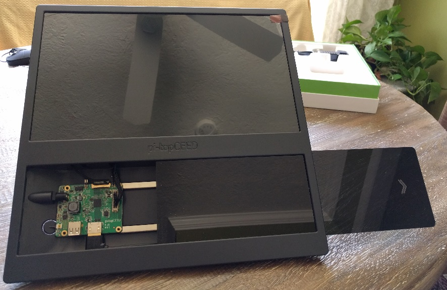
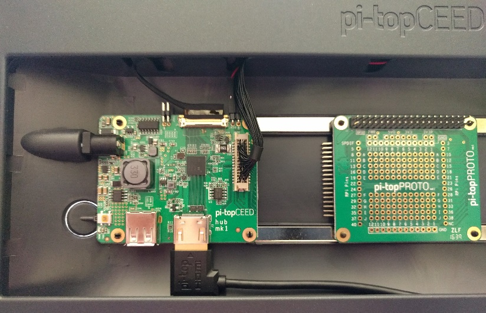
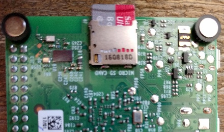
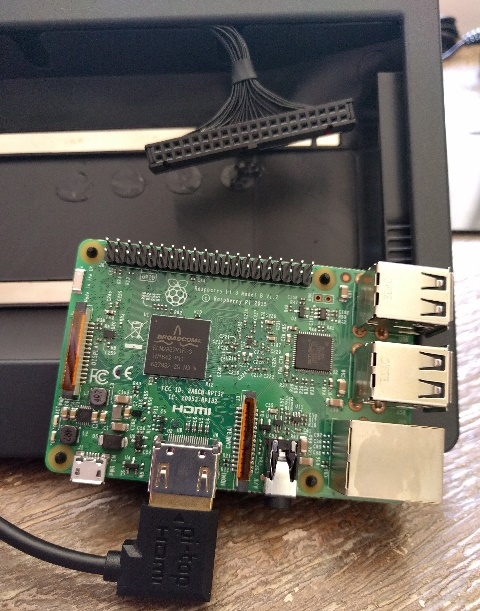

Pi-Top CEED Setup
=================

Inventory Equipment
-------------------
Take a moment to make sure you have
everything you need.

1.  Pi-Top CEED

2.  Raspberry Pi

3.  Keyboard / Mouse

4.  Pi-Top Proto

5.  Cana Kit

6.  Battery Pack

7.  Servos (2 ea)

8.  AA Batteries (4 ea) \[Not Shown\]

Pi-Top CEED Setup
-----------------

{width="4.025in" height="2.607638888888889in"}
Setting up the pi-top CEED is easy. To get everything setup, you will
need to unbox the pi-top CEED, pi-top proto, the Raspberry Pi 3, and the
keyboard/mouse.

1.  Open up the pi-top CEED and slide the lower acrylic window to the
    right to install the pi-top proto and the Raspberry Pi.

    {width="1.6368143044619423in"
    height="2.4494444444444445in"}

2.  {width="2.7416666666666667in"
    height="1.601388888888889in"}Place the magnet footings into the
    holes on the pi-top proto and the Raspberry Pi.

    {width="1.9833333333333334in"
    height="1.5946008311461068in"}

3.  The pi-top proto will mount to the metal rails and slide left to
    seat the male pins into the female connector of the pi-top CEED
    control board.

    {width="3.3722222222222222in"
    height="2.4125in"}{width="3.7479516622922135in"
    height="2.4166666666666665in"}

4.  {width="1.9993055555555554in"
    height="2.923611111111111in"}Before installing the Raspberry Pi,
    insert the micro SD card provided with the pi-top CEED into the
    Raspberry Pi micro SD slot on the bottom of the card.

    {width="2.0479166666666666in"
    height="1.3097222222222222in"}{width="2.0006944444444446in"
    height="1.175in"}

5.  {width="2.183333333333333in"
    height="2.776781496062992in"}Now connect the HDMI cord to the
    Raspberry Pi. Also, connect the 40-pin connector from the pi-top
    CEED to the 40-pin male pins on the Raspberry Pi. The red wire
    should be on the left.

{width="2.3745494313210846in"
height="2.700219816272966in"}

1.  The Raspberry Pi will mount to the metal rails and slide right so
    the USB slots are accessible.

    {width="3.05in"
    height="2.2132053805774277in"}

2.  Insert the USB connectors for the keyboard and mouse into the
    Raspberry Pi.

    {width="2.425in"
    height="2.8716174540682413in"}

    {width="3.2083333333333335in"
    height="2.3879615048118987in"}

3.  {width="5.658333333333333in"
    height="2.908963254593176in"}The power cable for the pi-top CEED is
    inserted into the back left of the pi-top CEED.

Connect GPIO Board
------------------

To easily interface with the servos and LEDs, you need to connect the
GPIO pins to a breadboard. Breadboards are great for prototyping builds.
You will learn more about them later.

1.  Connect the Cana Kit breadboard adapter to your breadboard.

    {width="3.558333333333333in"
    height="1.4417804024496939in"}{width="3.727128171478565in"
    height="1.5166666666666666in"}

    {width="1.8735564304461942in"
    height="3.0416666666666665in"}

2.  Connect the ribbon cable to the breadboard adapter.

    {width="3.1in"
    height="2.351360454943132in"}{width="2.0083333333333333in"
    height="2.365982064741907in"}

3.  {width="2.536111111111111in"
    height="1.9020833333333333in"}Connect the ribbon cable to the pi-top
    proto pins. The red strip must be on the left.

Initialize the Pi-Top OS
------------------------

It’s time to start your Pi-Top CEED!

1.  Power on your pi-top CEED by pressing the power button on the back
    left. Press and hold the button and look for the power lights on the
    Raspberry Pi.

    {width="4.824745188101487in"
    height="1.8185575240594927in"}

2.  The operating system will boot into its initial setup screen. Click
    on “Get Started” and select the “US Keyboard”.

    {width="3.188888888888889in"
    height="2.3916666666666666in"}{width="3.188888888888889in"
    height="2.3916666666666666in"}

3.  Connect to a wireless network access point by clicking on “Select
    Wi-Fi Network”. You can click “Skip” if you are not near an access
    point.

    {width="3.408333333333333in"
    height="2.55625in"}

4.  Enter the operating system.

    {width="5.05in" height="3.7875in"}

Congratulations! You are all setup. Now enjoy some programming.

Introduction to Programming with Python
=======================================

{width="3.2583333333333333in" height="2.44375in"}“Hello World” in Python
-------------------------------------------------------------------------------------------------

Now it’s time to write your first Python program using your Pi. To do
this follow the steps below:

1.  In the “Quick Launch” menu, click on the Desktop icon.

2.  Go the very lower left corner of the desktop and click on the icon
    that looks like a computer terminal. A menu will open. Select Python
    3 (IDLE) as shown in the figure.

3.  A new window labeled “Python 3.4.2 Shell” will open.

4.  Go to the File menu and click on “New File”. You will enter commands
    in this newest window.

{width="3.2583333333333333in"
height="1.4041666666666666in"}

1.  {width="3.2583333333333333in"
    height="1.1479166666666667in"}Add the print statement as shown in
    the figure to the below. You will also notice that the file was
    saved as “Hello.py”.

2.  {width="3.238888888888889in"
    height="2.0590277777777777in"}To run the program, go to the Run menu
    and click on Run Module. You will probably notice that you can just
    push F5 to get the job done. You should see the program output in
    the Python Shell window. Congratulations, you’ve just run your first
    Python program.

A Few Python Coding Tricks
--------------------------

Python can do so much more than printing Hello World to the screen. You
will get to try some of these things in the next few exercises.

1\. Python can take input from you, the user, and also do mathematics.
Enter the code in the text box and run the program in the same way you
ran Hello.py program in the previous section. You might want to save
this new file with a different name (perhaps something like
inputName.py) which is up to you.

In this program, you are asked to enter your name and it then prints it
out to the screen. Then, you see a way to get the Python program to
repeat commands over and over with what is known as a for loop. It also
uses the expression x == 5 to compare the value of x to 5 and it prints
out False if the comparison is false but True when x is in fact equal to
5.

2\. Use the &gt; comparison operator to make Python print out whether or
not x is greater than 5.

3\. As you might expect, the &lt; operator will check to see if x is less
than 5. Try it.

4\. What does != do? Try it.

5\. Python can also do calculations and make comparisons using what are
known as if-else blocks. Enter the program in the text box to see how it
works.

Pay close attention to the way Python multiplies (using the \*), and
divides (using the /). The if, elif, and else are important features of
this code.

If You Have Time
----------------

Python (and most programming languages as well) have libraries of
commands that make coding a lot easier. Enter the following code which
imports the random number generator library so see how to use them in
Python. The code will print a random integer (between 1 and 6) to the
screen to simulate a roll of a 6-sided dice.

**Challenge:** Many games use two dice throws to determine the next
move. Imagine, for example, you are playing Monopoly and you’ve lost
your dice but you have your Pi ready to go. Use the random number
generator to make two dice throws, add them, and print out the total.
Also see if you can figure out how to print out “**Double**” if the two
throws happen to be the same (so both dice throws are twos or threes).
You’ll probably need to use the comparison operator **==** but there are
other ways to do this last bit.

Lab: Light Emitting Diodes
==========================

Learning Objective: Introduce, install, and setup General Purpose
Input/Output board.

GPIO on the Pi
--------------

{width="3.775in" height="2.58125in"} One of the
exciting things about the Pi is its 40 General Purpose Input/Output
(GPIO) pins. These pins, as you can see from the figure below, have
names like GPIO 4, GPIO 21, and so on. You can use these pins to make
things happen (or “actuate”). You can also use them to sense the
physical world. In the next few labs, you will learn to:

-   Turn an LED on and off using the Pi

-   Sense when a button is pushed

-   Control a servo motor

But first things first. In order to make any of this work, you’ll need
to connect the GPIO to a breadboard and learn a little about how to
connect simple circuits.

1.  First connect the ribbon cable to the Pi. *Make sure the red stripe
    on the cable is on the left side*. See the figure below.

{width="2.536111111111111in"
height="1.9020833333333333in"}

1.  Align and install the breakout board onto the breadboard. See figure
    below.

2.  {width="3.1222222222222222in"
    height="2.341666666666667in"}Connect the ribbon cable to the
    breakout board. *Make sure the red stripe is on the side labeled 5V*
    as shown in the figure.

LED Blink – Using Digital Output on the Pi
------------------------------------------

Now it’s time to get the Pi to blink an LED on and off. This will
require making a circuit on the breadboard and using one of the GPIO
pins (we’ll use pin 21, but any pin would work just fine) on the Pi to
either turn the LED on or turn it off. Let’s build the circuit first.

In order to connect electrical components (like resistors and LEDs) we
will use a breadboard. Breadboards typically have clusters of 5 holes
which are all electrically connected. These are separated down the
middle with a trough. There is not a connection across the trough – only
these clusters of 5 on either side of the trough (see figure). Most
breadboards also have long rows of 25 connection holes (again, see
figure). These are used as a “bus” or “rail” and in the case of the Pi
are used to make connecting to ground, +3.3V and +5V very convenient.
The diagram below might help you see how the breadboard is designed.

{width="3.4in" height="2.3583333333333334in"}

1.  Use a wire to connect from GPIO pin 21 on the break out board to a
    resistor (use one of the 220 Ohm resistors – they have stripes in
    this order: Red, Red, Brown).

2.  Then connect an LED from the end of the resistor to the ground rail.
    Make sure the *short leg of the LED* *is connected to ground*! The
    figure below shows the completed circuit.

{width="3.2666666666666666in" height="2.45in"}

1.  Now enter the code so you can blink the LED! You probably ought to
    save it as blink.py or something like that. Run the program and, if
    you’ve got it all just right, watch the LED flash on and off.

A few things to note here:

-   We are importing the two libraries “time” and “RPi.GPIO” in the
    program. These give us access to both the timekeeping capability of
    the Pi and the GPIO pins.

-   The command GPIO.setmode(GPIO.BCM) tells the Pi we will be using the
    pin numbers on the breakout board. And in the next line of the
    program we make the GPIO 21 pin an output so we can control or
    actuate the LED.

-   The while(1) command is a while loop and it will continue forever
    since its argument is 1 or “true”.

If you push the CTRL-C you will stop to program – this is known as a
keyboard interrupt.

If You Have Time
----------------

1.  Change the time.sleep(0.5) command to time.sleep(2). You should
    notice that this number is a sort of delay which sets the rate the
    LED blinks.

2.  Add a second resistor/LED and make those blink two. Can you figure
    out how to make them alternately blink so that one is always on
    while the other is off?

Lab: Push Button Input
======================

Reading a Pushbutton – Using Digital Input on the Pi
----------------------------------------------------

The GPIO pins on the Pi can also be used to sense the physical
environment and we’ll use it to sense whether or not a button is pushed.

{width="4.488888888888889in"
height="3.3666666666666667in"}1. Use a wire to connect the +5V rail to
one side of the pushbutton

2\. Connect the other side of the pushbutton through a 10 kilo-ohm (which
is brown-black-brown) to ground.

3\. Then connect another wire to GPIO 26 which will be used to read the
state of the pushbutton. The figure shows the correct circuit
connections (see figure which still includes the LED circuit for use
later!). When the button is pushed it will connect the +5V rail to the
GPIO 26 pin. We will sense that with the Pi.

4\. Enter the code and get it running.

5\. Now for a little challenge: Add the command LEDpin = 21 and the line
GPIO.setup(LEDpin, GPIO.OUT) into your existing code for the pushbutton.

6\. Next add a GPIO.output(LEDpin, True) so the LED goes on when the
button is pushed. Also add a GPIO.output(LEDpin, False) to turn the LED
off when the button is released.

If You Have Time
----------------

Add a second resistor and LED to your setup and alter the code so that
the second LED goes off when the button is pressed but is on otherwise.

Lab: Servos
===========

Basic Servo Motor Control with the Pi
-------------------------------------

Servo motors are very convenient to use when you want to rotate or turn
something to a particular angle. With the servo you simply send it
pulses – the time duration or “width” of the pulses will determine the
angle to which it moves. Most often the width of the pulses is
controlled using what engineers call Pulse Width Modulation or PWM. In
this section we’ll first see how to connect the servo to the breadboard
and then we’ll code it so that it moves from one position to the other.

The servo has three connecting wires:

-   Brown – This is connected to the ground rail.

-   {width="2.6083333333333334in"
    height="1.95625in"}Red – This is connected to the +V from your
    battery pack and supplies the large current needed to move the
    servo.

-   Orange-Yellow – This is connected to one of the GPIO pins from the
    Pi. We’ll use GPIO 19 in this particular example. This pin will
    carry the PWM signal to the servo.

To make the connections to the breadboard, use a 3-lead “header pin”
which you can see in the image to the right.

Complete the circuit connections as follows:

1.  Use a wire to connect the brown lead to the ground rail.

2.  Connect the battery pack leads – the black lead should connect to
    ground and the red lead of the battery pack should connect directly
    into the breadboard to the red lead from the servo.

3.  Finally use one more wire to connect the orange-yellow lead to
    GPIO 19. After you have that sorted out you’re ready to code the Pi
    to make it move.

{width="4.022222222222222in"
height="3.0166666666666666in"}

1.  Enter the code shown below and check that your servo is working
    properly.

LAB: Draw Bridge Traffic Control Station
========================================

Overview
--------

In this lab, we will build a simple simulation of traffic control gates
for a drawbridge. One gate will close to stop cars on the road and one
gate will open to allow traffic on the water. A traffic light will
change from green to red to stop cars on the road as the gate closes. A
push button will be used to control the gates and lights.

{width="4.22413823272091in"
height="2.9641174540682416in"}

You can do this project on your own or with a group. The key to success
is to break the project down into smaller parts. You can do it on your
own or follow along with the workbook. []{#_Hlk480110583 .anchor}This
workbook will provide recommended steps and the solution at the end.

Note: Remember to place comments in your code. Use the ‘\#’ (hashtag)
symbol at the beginning of each line for comments.

Step 1: Build the Circuit
-------------------------

The circuit diagram shown in the figure below will simulate the traffic
control station. Build your circuit on your breadboard. This circuit
will fit on a small 400 pin board but you will need to carefully plan
the position of each device.

{width="7.0783978565179355in"
height="5.379309930008749in"}

Step 2: Define GPIO mode and Set Input/Output Pins
--------------------------------------------------

This is an important place to start for this lab. At the beginning of
your code you need to import two modules: the RPi.GPIO module as GPIO,
and the time module.

Next, set the GPIO mode for Broadcom SOC channel (BCM) numbering. This
tells python how you are going to name the pins. We will use the pins
that have names like GPIO 1 or GPIO 12.

Now that your program knows how you are naming pins, define your input
pin. You only have one input pin for this lab. The push button circuit
for this lab is a pull-down circuit.

Finally, define your output pins for the LEDs. You should have three
output pins per the circuit diagram. GPIO 16 outputs a signal to the red
LED. GPIO 20 outputs a signal to the yellow LED. GPIO 21 outputs a
signal to the green LED.

Step 3: Set Output for Servos and set the start position
--------------------------------------------------------

Now you need to set the output pins for the servos and initialize them
to the closed position. The pulse wave modulation pins for this lab are
GPIO 12 and GPIO 13. We will set the clock frequency to 50 Hz.

To set the servo to the full left position or “gate closed”, we will use
duty cycle values. The duty cycle is defined as a percentage which is
equal to the control pulse times the clock frequency. The control pulse
is the time value used to signal the servo to set a position. The clock
frequency is 50 Hz.

Step 4: Define Function for Traffic Light Changes
-------------------------------------------------

It’s time to define the function you will use to control the LEDs.
Functions are useful when you will do the same action several times in
your program. You can also pass a variable into your function so it will
take action based on the value of variable.

Step 5: Enter Loop to monitor Push Button and control Gates
-----------------------------------------------------------

In this step, you need to create the core of your program. Loops are
great for performing the same action repeatedly. You can also control
the loop with a variable. To enter a permanent loop, set the loop
condition to True. This is useful when listening for button inputs but
you need an exit condition or your program will run indefinitely. Here
is sample code with an exit condition that will be useful for this lab.

Be sure to initialize the circuit to open the road for traffic and close
the water way gate. To open the gate, we will rotate the servo 90
degrees right. For this servo that is a 2 ms signal. Remember our duty
cycle calculations.

It’s also important to clean up your circuit before exiting the program.
The GPIO.cleanup() command will reset all the GPIO pins.

Step 6: Test and Troubleshoot
-----------------------------

You should have a circuit on your breadboard and written program. Now
comes the fun of debugging and troubleshooting. Don’t be discouraged by
errors. Even professional programmers and engineers make mistakes and
have to debug their code. Good programmers are really good at debugging
code. With practice, you will improve. Good Luck!

(Solution) LAB: Draw Bridge Traffic Control Station
===================================================

Overview
--------

In this lab, we will build a simple simulation of traffic control gates
for a drawbridge. One gate will close to stop cars on the road and one
gate will open to allow traffic on the water. A traffic light will
change from green to red to stop cars on the road as the gate closes. A
push button will be used to control the gates and lights.

{width="4.22413823272091in"
height="2.9641174540682416in"}

You can do this project on your own or with a group. The key to success
is to break the project down into smaller parts. You can do it on your
own or follow along with the workbook. This workbook will provide
recommended steps and the solution at the end.

Note: Remember to place comments in your code. Use the ‘\#’ (hastag)
symbol at the beginning of each line for comments.

Step 1: Build the Circuit
-------------------------

The circuit diagram shown in the figure below will simulate the traffic
control station. Build your circuit on your breadboard. This circuit
will fit on a small 400 pin board but you will need to carefully plan
the position of each device.

{width="7.0783978565179355in"
height="5.379309930008749in"}

Step 2: Define GPIO mode and Set Input/Output Pins
--------------------------------------------------

This is an important place to start for this lab. At the beginning of
your code you need to import two modules: the RPi.GPIO module as GPIO,
and the time module.

Next, set the GPIO mode for Broadcom SOC channel (BCM) numbering. This
tells python how you are going to name the pins. We will use the pins
that have names like GPIO 1 or GPIO 12.

Now that your program knows how you are naming pins, define your input
pin. You only have one input pin for this lab. The push button circuit
for this lab is a pull-down circuit.

Finally, define your output pins for the LEDs. You should have three
output pins per the circuit diagram. GPIO 16 outputs a signal to the red
LED. GPIO 20 outputs a signal to the yellow LED. GPIO 21 outputs a
signal to the green LED.

Step 3: Set Output for Servos and set the start position
--------------------------------------------------------

Now you need to set the output pins for the servos and initialize them
to the closed position. The pulse wave modulation pins for this lab are
GPIO 12 and GPIO 13. We will set the clock frequency to 50 Hz.

To set the servo to the full left position or “gate closed”, we will use
duty cycle values. The duty cycle is defined as a percentage which is
equal to the control pulse times the clock frequency. The control pulse
is the time value used to signal the servo to set a position. The clock
frequency is 50 Hz.

Step 4: Define Function for Traffic Light Changes
-------------------------------------------------

It’s time to define the function you will use to control the LEDs.
Functions are useful when you will do the same action several times in
your program. You can also pass a variable into your function so it will
take action based on the value of variable.

Step 5: Enter Loop to monitor Push Button and control Gates
-----------------------------------------------------------

In this step, you need to create the core of your program. Loops are
great for performing the same action repeatedly. You can also control
the loop with a variable. To enter a permanent loop, set the loop
condition to True. This is useful when listening for button inputs but
you need an exit condition or your program will run indefinitely. Here
is sample code with an exit condition that will be useful for this lab.

Be sure to initialize the circuit to open the road for traffic and close
the water way gate. To open the gate, we will rotate the servo 90
degrees right. For this servo that is a 2 ms signal. Remember our duty
cycle calculations.

It’s also important to clean up your circuit before exiting the program.
The GPIO.cleanup() command will reset all the GPIO pins. Here is how we
completed the program.

Step 6: Test and Troubleshoot
-----------------------------

You should have a circuit on your breadboard and written program. Now
comes the fun of debugging and troubleshooting. Don’t be discouraged by
errors. Even professional programmers and engineers make mistakes and
have to debug their code. Good programmers are really good at debugging
code. With practice, you will improve. Good Luck!

Student Notes

Thank You to our Sponsors

{width="3.175in"
height="1.7362642169728784in"}{width="3.269364610673666in"
height="1.4in"}{width="3.5083333333333333in"
height="2.2734930008748906in"}{width="2.7916666666666665in"
height="2.7916666666666665in"}{width="4.471543088363955in"
height="1.075in"}{width="4.681342957130359in"
height="1.025in"}
